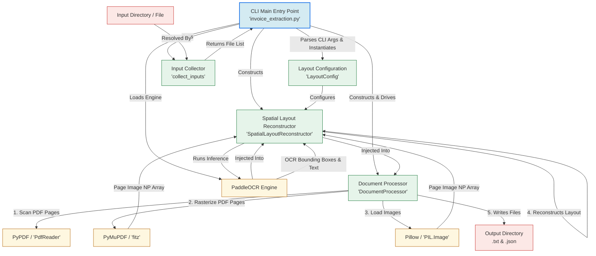

# PaddleOCR Spatial Layout Reconstructor — Architecture Documentation

This document provides a comprehensive analysis of the architectural design, core pipelines, component structures, and spatial reconstruction algorithms implemented in the **Text Extraction** codebase.

---

## 1. System Overview

The primary objective of this project is to extract text from documents (both static images and multi-page PDFs) while preserving their original spatial layout (e.g., table alignments, columns, indentation, and grid-like visual relationships). 

Maintaining the exact spatial format is essential for downstream analysis of semi-structured documents, such as **invoices, purchase orders, shipping manifests, and receipts**, where the spatial correlation of tokens carries significant semantic meaning (e.g., associating a line item description with its unit cost).

### Key Features
* **Multi-Format Input Pipeline**: Gracefully handles single files or entire directories of images (`.png`, `.jpg`, `.jpeg`, `.bmp`, `.tiff`) and `.pdf` files.
* **Preservation of Visual Column Alignments**: Maps irregular OCR bounding boxes onto a consistent character canvas grid.
* **Dynamic DPI Rasterization**: Employs PyMuPDF to render vector PDF pages into high-fidelity raster images at dynamic resolutions.
* **Dual Output Architecture**: Produces a human-readable `.txt` layout map and a structured `.json` object containing precise coordinate-linked metadata.

---

## 2. Component Architecture Diagram

The diagram below details the structural relationships between the application components and libraries, tracing data from cli inputs to the final persistence layer.



---

## 3. Class & Component Breakdown

### A. Main Entry Point: `invoice_extraction.py`
The CLI controller is responsible for orchestrating the setup and execution loop. It handles the following:
* **CLI Parameter Management**: Uses `argparse` to ingest customizable thresholds (canvas width, vertical clustering tolerances, confidence filters, and PDF DPI resolutions).
* **Logging Setup**: Standardizes console logs to format execution steps in a readable manner.
* **Engine Lifecycle**: Boots up the `PaddleOCR` model instance with the configured language (`lang="en"`) and execution flags.
* **Batch Orchestration**: Loops through the collected inputs, triggers the `DocumentProcessor`, handles file-level metric aggregation (run duration, word blocks, page counts), and logs final statistics.

### B. Configuration Module: `utils/layout_config.py`
Defines a central configuration registry using Python's `@dataclass`.

| Property | Type | Default Value | Description |
| :--- | :--- | :--- | :--- |
| `output_width` | `int` | `120` | Canvas width measured in characters. Dictates the column resolution of the output text. |
| `row_tolerance` | `int` | `10` | Vertical clustering tolerance in pixels. Determines if text blocks belong to the same line. |
| `min_confidence` | `float` | `0.5` | Threshold to discard low-confidence OCR text blocks. |
| `pdf_dpi` | `int` | `100` | Rasterization density (dots per inch) for converting vector pages into images for OCR. |

### C. Document Processing Pipeline: `utils/document_processor.py`
Handles multi-format system operations and maps raw files to standard input representations.
* **`collect_inputs(input_path)`**: Resolves a path (supporting single file or folder targets) and returns a list of matched items classified by type (`pdf` or `image`).
* **`process_image(image_path)`**:
  1. Opens the image using Pillow, converting it into a standard RGB NumPy array.
  2. Passes the array to the `SpatialLayoutReconstructor`.
  3. Formulates a JSON schema mapping page metadata, block counts, and character-mapped lines.
  4. Saves `.txt` and `.json` files to the output directory.
* **`process_pdf(pdf_path)`**:
  1. Leverages `pypdf.PdfReader` inside `identify_target_pages` to evaluate page counts and boundaries.
  2. Opens the file with `pymupdf` (`fitz`).
  3. Computes the zoom matrix from DPI scaling (`zoom = pdf_dpi / 72.0` because PyMuPDF's default scaling factor is 72 DPI).
  4. Iteratively rasterizes pages into RGB numpy buffers.
  5. Feeds each page image through the layout reconstructor, merging page-wise outputs using visual header delimiters (`PAGE X | Y blocks detected` and line boxes `===`).
  6. Outputs combined documents.

### D. Spatial Layout Reconstructor: `utils/spatial_reconstructor.py`
The core algothrimic block that builds a structured visual representation from scattered spatial tokens. It executes three key phases sequentially for every page image:

#### Phase 1: Valid Block Extraction (`_extract_valid_blocks`)
Accepts raw PaddleOCR outputs (supporting standard lists and PaddleX dictionaries).
* Iterates through elements, enforcing `min_confidence`.
* Extracts the standard coordinates of the bounding box polygon: `[[x1,y1], [x2,y2], [x3,y3], [x4,y4]]`.
* Computes the bounding limits:
  $$\text{x\_min} = \min(x_1, x_2, x_3, x_4)$$
  $$\text{x\_max} = \max(x_1, x_2, x_3, x_4)$$
  $$\text{y\_mid} = \frac{\min(y_1, y_2, y_3, y_4) + \max(y_1, y_2, y_3, y_4)}{2}$$
* Tracks page-wide bounds `ix_min` and `ix_max` to identify active content widths and prevent layout stretching or compressing due to blank margin padding.

#### Phase 2: Row Proximity Clustering (`_cluster_into_rows`)
Groups irregular spatial points into coherent rows.
1. Sorts all valid blocks vertically by their center coordinate `y`.
2. Groups adjacent blocks into a single row if their vertical distance difference satisfies:
   $$|y_{block} - y_{row\_origin}| \le \text{row\_tolerance}$$
3. Once clustered vertically, sorts each row's individual blocks horizontally from left to right:
   $$\text{sort key} = x$$

#### Phase 3: Character Column Mapping & Rendering (`_render_lines`)
Projects bounding box coordinates onto a character-based coordinate system.
1. Computes the effective content width: $\text{iw} = \max(\text{ix\_max} - \text{ix\_min}, 1.0)$.
2. For each cluster row, creates an array of spaces of length `output_width`.
3. Maps each block's horizontal coordinate $x$ to a discrete column index using linear interpolation:
   $$\text{col} = \left\lfloor \frac{x - \text{ix\_min}}{\text{iw}} \times (\text{output\_width} - 1) \right\rfloor$$
4. Overwrites the spaces array starting at `col` with the characters of the detected text string, ensuring bounds are capped at `output_width` to prevent array overflows.
5. Returns a clean string representing the row.

---

## 4. Technical Data Flow

The lifecycle of a single document processing run is detailed in the step-by-step sequential path below:

```
[Input Document] 
       │
       ▼
 ┌──────────┐      Image (PNG, JPG, etc.)      ┌──────────────────┐
 │  Input   ├─────────────────────────────────►│   Pillow (PIL)   │
 │ Resolver │                                  └────────┬─────────┘
 └─────┬────┘                                           │ (NumPy RGB Array)
       │                                                ▼
       │           PDF Document                ┌──────────────────┐
       └──────────────────────────────────────►│ PyMuPDF (fitz)   │
                                               └────────┬─────────┘
                                                        │ (DPI Rasterization)
                                                        ▼
                                               ┌──────────────────┐
                                               │    PaddleOCR     │
                                               └────────┬─────────┘
                                                        │ (Raw Bounding Boxes)
                                                        ▼
                                               ┌──────────────────┐
                                               │ _extract_blocks  │
                                               └────────┬─────────┘
                                                        │ (Confidence Filter)
                                                        ▼
                                               ┌──────────────────┐
                                               │ _cluster_rows    │
                                               └────────┬─────────┘
                                                        │ (Sorted Row Groups)
                                                        ▼
                                               ┌──────────────────┐
                                               │  _render_lines   │
                                               └────────┬─────────┘
                                                        │ (Canvas Mapping)
                                                        ▼
                                               ┌──────────────────┐
                                               │  _save_results   │
                                               └────────┬─────────┘
                                                        │
                                      ┌─────────────────┴─────────────────┐
                                      ▼                                   ▼
                            ┌──────────────────┐                ┌──────────────────┐
                            │    TXT Output    │                │   JSON Output    │
                            │ (Visual Layout)  │                │   (Structured)   │
                            └──────────────────┘                └──────────────────┘
```

---

## 5. Output Data Formats

For every source document processed, two primary files are generated within the output directory:

### 1. Plain Text Output (`.txt`)
Provides a visual approximation of the document. Spatially correlated data columns are aligned directly under their headers using padding spaces, and page splits are clearly demarcated.

### 2. Structured JSON Output (`.json`)
Saves a complete metadata envelope and coordinate mapping. This output is ideal for downstream database insertions, REST APIs, or parsing scripts.

#### JSON Output Example Schema:
```json
{
  "meta": {
    "output_width": 120,
    "row_tolerance": 10,
    "min_confidence": 0.5,
    "pdf_dpi": 100,
    "source": "./input/invoice_sample.pdf",
    "parsed_at": "2026-06-01 11:15:32",
    "page_count": 1,
    "total_blocks": 24
  },
  "pages": [
    {
      "page": 1,
      "source": "./input/invoice_sample.pdf",
      "block_count": 24,
      "rows": [
        {
          "row": 1,
          "rendered_line": "INVOICE                                                #INV-2026-004"
        },
        {
          "row": 2,
          "rendered_line": "Date: 2026-06-01                                     Due Date: 2026-07-01"
        },
        {
          "row": 3,
          "rendered_line": "------------------------------------------------------------------------"
        },
        {
          "row": 4,
          "rendered_line": "Description                  Qty         Unit Price             Amount"
        },
        {
          "row": 5,
          "rendered_line": "Spatial OCR Software Suite    1          $1,200.00           $1,200.00"
        }
      ]
    }
  ]
}
```

---

## 6. Execution & Parameters guide

The utility can be executed via the command line with several options to tune performance based on specific document types:

```bash
python invoice_extraction.py --input ./input --output ./output --width 120 --tolerance 10 --confidence 0.5 --dpi 150
```

### Key Parameter Tuning Recommendations:
* **Complex Multi-Column Tables**: Increase `--width` to `150` or `180` to expand the column grid and prevent text blocks in adjacent columns from overlapping.
* **Narrow Line Spacing**: Decrease `--tolerance` to `6` or `8` to prevent text lines that are very close vertically from being mistakenly clustered into a single row.
* **Handwritten or Faint Invoices**: Lower `--confidence` to `0.4` to preserve faint characters, though this may increase noise blocks.
* **Low-resolution Vector PDFs**: Increase `--dpi` to `150` or `200` to yield sharper images during the rasterization process, improving the OCR character recognition rate.
