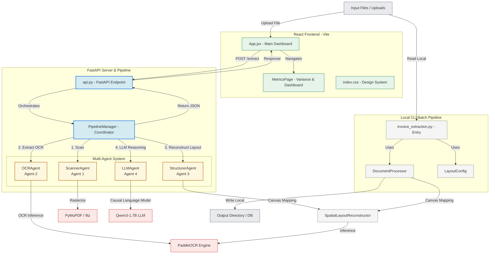

# PaddleOCR Spatial Layout Reconstructor — Architecture Documentation

This document provides a comprehensive analysis of the architectural design, core pipelines, component structures, and spatial reconstruction algorithms implemented in the **Text Extraction** codebase.

---

## 1. System Overview

The primary objective of this project is to extract text from documents (both static images and multi-page PDFs) while preserving their original spatial layout (e.g., table alignments, columns, indentation, and grid-like visual relationships) and performing semantic reasoning over the extracted text to identify key financial metrics.

Maintaining the exact spatial format is essential for downstream analysis of semi-structured documents, such as **invoices, purchase orders, shipping manifests, and receipts**, where the spatial correlation of tokens carries significant semantic meaning (e.g., associating a line item description with its unit cost).

### Key Features
* **Dual-Pipeline Architecture**:
  1. **Local CLI Tool**: Processes batch files directly into plain text layout files (`.txt`) and structured visual layouts (`.json`).
  2. **Full-Stack Web App**: Provides an interactive React dashboard that communicates with a FastAPI server to run an agentic LLM pipeline for financial metrics extraction.
* **Multi-Format Input Pipeline**: Gracefully handles single files or entire directories of images (`.png`, `.jpg`, `.jpeg`, `.bmp`, `.tiff`) and `.pdf` files.
* **Preservation of Visual Column Alignments**: Maps irregular OCR bounding boxes onto a consistent character canvas grid using linear interpolation.
* **Dynamic DPI Rasterization**: Employs PyMuPDF (`fitz`) to render vector PDF pages into high-fidelity raster images at dynamic resolutions.
* **Four-Agent Extraction Pipeline**: Coordinates document scanning, text extraction, spatial reconstruction, and generative LLM reasoning.
* **Financial Analysis Dashboard**: Evaluates and visualizes standard Earned Value Management (EVM) parameters like Budget at Completion (BAC), Actual Cost (AC), and Variance (BAC - AC).

---

## 2. Component Architecture Diagram

The diagram below details the structural relationships between the web application, backend API, multi-agent pipeline, and local CLI tools.



---

## 3. Class & Component Breakdown

### A. Frontend Dashboard (React + Vite)
Located in the `frontend` directory, it contains the user interface components:
* **`src/App.jsx`**: The main interface managing state for file selection, upload interaction, and JSON display. It triggers document extraction via a POST request to `/extract`.
* **`src/App.jsx (MetricsPage)`**: Computes and displays the financial metrics. It parses `budget_at_completion` (BAC) and `actual_cost` (AC), calculates the financial `variance` (BAC - AC), and provides warning messages if costs exceed the budget.
* **`src/index.css`**: Standardizes visual elements with responsive grid layouts, custom card classes, loading states, and custom badge styling.

### B. FastAPI Endpoint: `backend/api.py`
The REST API backend orchestrates document uploads and pipeline executions:
* **`POST /upload`**: Receives document files and writes them to the `uploads/` directory with a unique UUID mapping.
* **`POST /extract`**: Processes a file dynamically. Saves the document to a temporary directory (`temp_uploads`), invokes `PipelineManager` to perform OCR and LLM-based field extraction, returns the structured JSON output, and cleans up the temporary files.

### C. The Multi-Agent Pipeline: `backend/pipeline.py`
Coordinates the extraction process across four specialized agent classes:
1. **`ScannerAgent` (Agent 1 - Document Scanner)**: Identifies document format. For images, it loads them into standard NumPy RGB buffers. For multi-page PDFs, it loads them using `fitz` (PyMuPDF) and renders them page-by-page at a configured DPI scaling factor (e.g., `zoom = dpi / 72`) as a memory-efficient generator.
2. **`OCRAgent` (Agent 2 - OCR Extraction)**: Wraps PaddleOCR inference. Converts RGB frames to BGR, executes OCR to retrieve tokens and bounding polygons, and logs character count statistics.
3. **`StructurerAgent` (Agent 3 - Layout Structurer)**: Coordinates with `SpatialLayoutReconstructor` to map raw OCR bounding boxes onto discrete rows and column indices, returning a JSON array representing the page's spatial layout.
4. **`LLMAgent` (Agent 4 - LLM Inference)**: Loads `Qwen/Qwen3-1.7B` on CPU (optimized with `torch.bfloat16` and `torch.set_num_threads(6)` for Intel 13th Gen architectures). Translates the reconstructed spatial page layout into a prompt, executes causal reasoning, and parses the generative response to extract key JSON parameters.
5. **`PipelineManager`**: Initializer and orchestrator. Bootstraps the models and routes document pages sequentially through the scanner, OCR, structurer, and LLM reasoning steps.

### D. Local CLI Components (`backend/utils/` and `backend/invoice_extraction.py`)
Provides direct CLI batch execution for local files:
* **`invoice_extraction.py`**: Boots the standalone `PaddleOCR` instance, reads command-line override parameters (width, tolerance, confidence, DPI), and batch-processes files from input directories.
* **`utils/layout_config.py`**: Registry dataclass for tuning parameters:
  * `output_width` (Default: `120`): Target canvas width in characters.
  * `row_tolerance` (Default: `10`): Vertical distance threshold in pixels for row grouping.
  * `min_confidence` (Default: `0.5`): Minimum score required to accept OCR blocks.
  * `pdf_dpi` (Default: `100` / `250`): Resolution for rendering PDF vector graphics.
* **`utils/document_processor.py`**: Manages the local file system interactions (reading directories of PDFs/images and writing output files).
* **`utils/spatial_reconstructor.py`**: Implements the layout mapping algorithm.

### E. Database & Schema Models (MongoDB Integration)
Integrates a data persistence layer to store extraction results and metadata:
* **`backend/models/`**: Package containing structured Pydantic V2 schemas:
  * **`extracted_fields.py`**: Holds line item and financial metrics schemas.
  * **`metadata.py`**: Defines visual and parsing document metadata schemas.
  * **`invoice.py`**: Houses the main database schemas (`InvoiceCreate` and `InvoiceSchema`), utilizing relative imports and handling ObjectId string mappings.
  * **`__init__.py`**: Exposes the schemas at the package level for clean module imports.
* **`backend/database.py`**: Handles connection management using a singleton `pymongo` client from `.env` configurations. Contains helper CRUD operations (`save_invoice`, `get_invoice_by_id`, `list_invoices`, `delete_invoice`) and performs automatic variance calculations during invoice creation.

---

## 4. Technical Data Flow

The codebase runs two distinct pipelines sharing the spatial mapping core:

### Web API Pipeline (Agentic LLM Extraction)
```
[Frontend App.jsx] ──(File Upload)──► [FastAPI Server] ──► [PipelineManager]
                                                                  │
                                 ┌────────────────────────────────┘
                                 ▼
                     1. [ScannerAgent] ────► Loads PIL Images / Rasterizes PDFs
                                 │
                                 ▼
                     2. [OCRAgent] ───────► Extracts raw characters & coordinates
                                 │
                                 ▼
                     3. [StructurerAgent] ──► Performs 2D Grid mapping using Reconstructor
                                 │
                                 ▼
                     4. [LLMAgent] ────────► Generates Qwen3 JSON containing BAC & AC
                                 │
                                 ▼
[Frontend MetricsPage] ◄──(JSON Response)◄─ [FastAPI Server]
```

### CLI Pipeline (Direct Local Formatting)
```
[Local Input Folder] ──► [invoice_extraction.py] ──► [DocumentProcessor]
                                                            │
                                                            ▼
                                              [SpatialLayoutReconstructor]
                                                            │
                                                            ▼
                                              Extracts and clusters bounding boxes
                                                            │
                                                            ▼
                                              Projects coordinates to character grid
                                                            │
                                                            ▼
                                              Saves local .txt and .json outputs
```

---

## 5. Spatial Reconstruction Algorithm

The underlying spatial reconstruction algorithm in [utils/spatial_reconstructor.py](file:///C:/Projects/text_extraction/backend/utils/spatial_reconstructor.py) works in three logical phases:

### Phase 1: Bounding Box Normalization
The model extracts bounding boxes, filters out entries with low confidence, and calculates the absolute horizontal boundary coordinates (`ix_min` and `ix_max`) and page heights:
$$\text{x\_min} = \min(x_1, x_2, x_3, x_4)$$
$$\text{x\_max} = \max(x_1, x_2, x_3, x_4)$$
$$\text{y\_mid} = \frac{\min(y_1, y_2, y_3, y_4) + \max(y_1, y_2, y_3, y_4)}{2}$$
$$\text{iw} = \max(\text{ix\_max} - \text{ix\_min}, 1.0)$$

### Phase 2: Vertical Clustering (Row Identification)
Detections are sorted vertically by their midpoints (`y_mid`). Elements are grouped into the same row if their distance satisfies:
$$|y_{\text{block}} - y_{\text{row\_origin}}| \le \text{row\_tolerance}$$
Once grouped, the elements inside each row are sorted horizontally from left to right.

### Phase 3: Character Column Interpolation
Each row is mapped onto a character array of size `output_width`. The column index for a block's starting character is computed via linear interpolation:
$$\text{col} = \left\lfloor \frac{x_{\text{min}} - \text{ix\_min}}{\text{iw}} \times (\text{output\_width} - 1) \right\rfloor$$
Characters are written into the array at their relative indices, and the array is joined as a string and stripped of trailing whitespace.

---

## 6. Output Data Formats

The extraction result returns two core JSON envelopes:

### 1. Spatial Layout JSON (Direct from Reconstructor / CLI)
Maps the exact layout of the page using spaced character lines:
```json
{
  "meta": {
    "output_width": 120,
    "row_tolerance": 10,
    "min_confidence": 0.5,
    "pdf_dpi": 100,
    "source": "invoice_sample.pdf",
    "parsed_at": "2026-06-16 12:15:32",
    "page_count": 1,
    "total_blocks": 24
  },
  "pages": [
    {
      "page": 1,
      "source": "invoice_sample.pdf",
      "block_count": 24,
      "rows": [
        {
          "row": 1,
          "rendered_line": "INVOICE                                                #INV-2026-004"
        },
        {
          "row": 2,
          "rendered_line": "Date: 2026-06-01                                     Due Date: 2026-07-01"
        }
      ]
    }
  ]
}
```

### 2. Extracted Fields JSON (Output of LLMAgent)
Contains semantic information parsed by the LLM:
```json
{
  "metadata": {
    "source": "invoice_sample.pdf",
    "parsed_at": "2026-06-16 12:15:45",
    "page_count": 1,
    "total_blocks": 24
  },
  "extraction": {
    "extracted_fields": {
      "budget_at_completion": 50000.0,
      "actual_cost": 12500.0,
      "invoice_number": "INV-2026-004",
      "date": "2026-06-01",
      "vendor_name": "Antigravity Spatial Systems",
      "line_items": [
        {
          "description": "Spatial OCR Software Suite",
          "quantity": 1,
          "unit_price": 12500.0,
          "amount": 12500.0
        }
      ],
      "total_amount": 12500.0
    }
  }
}
```

---

## 7. Execution Guide

### Running the Local CLI Tool
To process documents locally and generate `.txt` layout files and `.json` mappings:
```bash
cd backend
python invoice_extraction.py --width 120 --tolerance 10 --confidence 0.5 --dpi 250
```
*(Note: Edit `invoice_extraction.py` to update `HARDCODED_INPUT` and `HARDCODED_OUTPUT` constants.)*

### Running the Backend API
Start the FastAPI server:
```bash
cd backend
python api.py
```
Or run with uvicorn:
```bash
uvicorn api:app --reload --host 0.0.0.0 --port 8000
```

### Running the React Frontend
Set your environment variables in `frontend/.env` (e.g., `VITE_API_URL=http://localhost:8000`), then start the development server:
```bash
cd frontend
npm install
npm run dev
```
